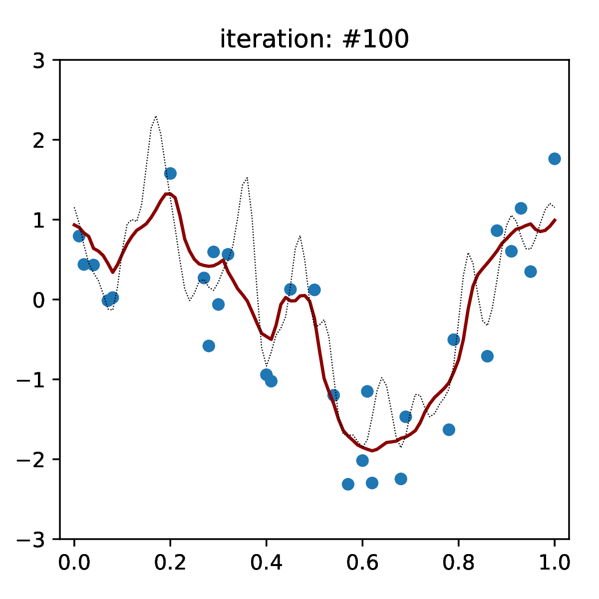
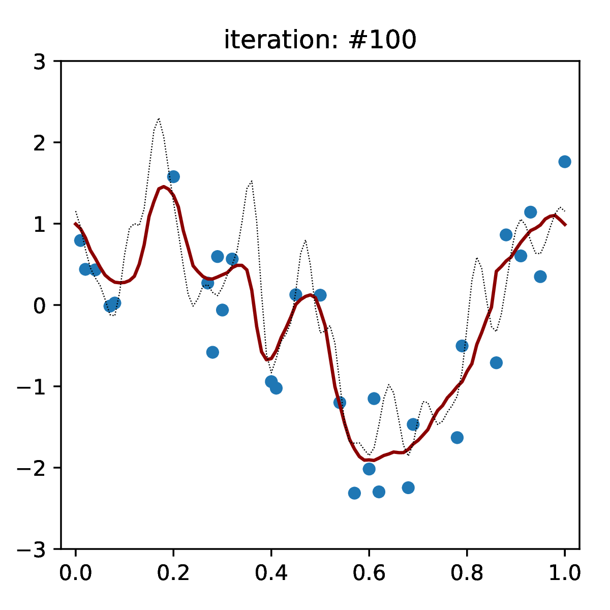

# Transformer with SAND for Functional Data Imputation

This repository contains the implementation of a Transformer-based model with the **SAND (Self-Attention on Derivatives)** module, designed for imputing functional data. The architecture maintains smooth imputations by incorporating inductive biases for smoothness, and supports high-dimensional irregularly sampled data.

---

## Imputation Visualization

<div style="display: flex; justify-content: space-around; align-items: center;">

  <!-- SAND Imputation GIF -->
  <div style="text-align: center;">
    
    <p>SAND Imputation</p>
  </div>

  <!-- Standard Transformer Imputation GIF -->
  <div style="text-align: center;">
    
    <p>Transformer Imputation</p>
  </div>

</div>

---

## Features

- **Transformer-based architecture** with SAND module for smooth functional imputation.
- Tensor shapes are consistent across all modules: `(batch, d, seq_len)`.
- Handles high-dimensional functional data with sparsity and optional error settings.
- Configurable **data loaders**, **model parameters**, and **optimization settings**.
- **Extensive training loop** with support for saving models periodically.
- Supports **imputation on testing data**.

---

## Requirements

The code is implemented in Python and requires the following dependencies:
- `torch`
- `DataUtils` (custom library, ensure it's included in your repository)
- `TransformerModel` (custom library, ensure it's included in your repository)

To install PyTorch, follow the instructions on the [official PyTorch website](https://pytorch.org/).

---

## File Structure

- **`DataUtils`**: Contains functions to load and preprocess data, including `getData` and `DataLoader`.
- **`TransformerModel`**: Implements the Transformer model and SAND layer. Includes training and imputation utilities.

---

## Getting Started

### **1. Define the Device**
The model runs on `cpu` by default. You can modify this by setting:
```python
device = torch.device("cuda" if torch.cuda.is_available() else "cpu")
```

### **2. Data Loading**
Set up the data configuration in the `dataloader_settings` dictionary. For example:
```python
dataloader_settings = {
    "d": 120,                   # Feature dimensionality
    "batch_size": 64,           # Batch size
    "split": (90, 5, 5),        # Train/Validation/Test split
    "device": device,           # Computational device
    "data_name": "HighDim_E"    # Dataset name
}
```
The `getData` function loads the data based on the dataset name, sparsity, and error configuration.

### **3. Model Configuration**
Model parameters are defined in the `model_settings` dictionary. Key parameters include:
```python
model_settings = {
    "num_heads": 2,                    # Number of attention heads
    "num_layers": (6, 6),              # Number of encoder/decoder layers
    "num_hiddens": 128,                # Hidden layer size
    "max_epoch": 5000,                 # Number of training epochs
    "dropout": 0.15,                   # Dropout rate
    "batch_size": 64,                  # Batch size
    "f_in": (122, 121),                # Input feature dimensions
    "device": device,                  # Computational device
    "dataloader_settings": dataloader_settings
}
```

### **4. Training**
The model is trained using the following settings:
```python
optimizer_settings = {
    "save_model_every": 200,   # Save model every 200 epochs
    "lr": 3e-4,                # Learning rate
    "weight_decay": 1e-8       # Weight decay
}
```
After defining the `Transformer` model and the optimizer, training is initiated:
```python
model = Transformer(model_settings).to(device)
optimizer = Adam(model.parameters(), lr=optimizer_settings["lr"], weight_decay=optimizer_settings["weight_decay"])
model.StartTraining(dataLoader, optimizer, optimizer_settings["save_model_every"], verbose=True)
```

---

## Testing and Imputation

To perform imputation on the testing data:
```python
X_test = X[int(X.shape[0] * (sum(dataloader_settings["split"][0:2])/sum(dataloader_settings["split"]))):]
T_test = T[int(X.shape[0] * (sum(dataloader_settings["split"][0:2])/sum(dataloader_settings["split"]))):]
SAND_imp, VT_imp = GetImputation(X_test, T_test, data_name="HighDim_E", sparsity="dense", error=False)
```
The `GetImputation` function generates imputed data for the test set.

---

## Usage

To run the code:
1. Ensure the required dependencies (`torch`, `DataUtils`, and `TransformerModel`) are available.
2. Adjust the `dataloader_settings` and `model_settings` for your specific dataset and configuration.
3. Run the script to train the model and generate imputations.

---

## Notes

- This implementation assumes all tensor shapes across modules are `(batch, d, seq_len)`.
- Default dataset is `HighDim_E` with dense sparsity and no error.

Feel free to modify the configurations to suit your specific use case.
